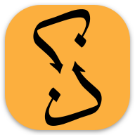

# Zikr-uz-Zikr (ذِكرُ الذِكرِ)

<table> <tr><td>

</td><td>

Space-repetition system (SRS) for solidifying the memorization of the Quran.  
Use it at [noureddin.github.io/zz](https://noureddin.github.io/zz).

تطبيق «تكرار متباعد» لتثبيت حفظ القرآن الكريم.  
استخدمه على [noureddin.github.io/zz](https://noureddin.github.io/zz).

</td></tr></table>

## License

Apache License, Version 2.

Copyright 2021 Noureddin.
